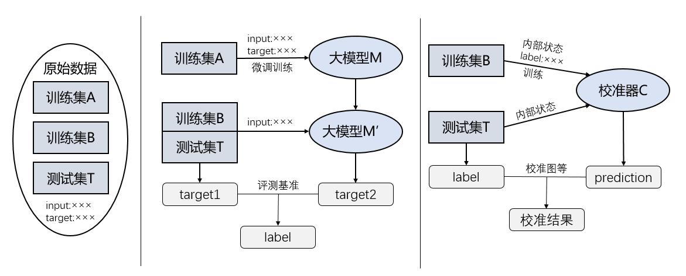

本代码库为谢国强毕设《医疗领域大语言模型校准技术研究》的代码
主要包含内容为医疗数据集及标签生成(包含CHIP-STS\CHIP-CTC\CMeEE-V2三个任务)，然后进行校准模型训练和评估

/conversion     包含数据变换的所有文件，包括CBLUE转化为PromptCBLUE/将注意力分数转化为max_a等/将预测值与baseline等提取出

/generate       PromptCBLUE数据集生成代码，为llama-lora微调代码

/calibration    校准模型代码，将上一步生成的数据来训练模型

/peft           generate需要的特定版本的peft库，仅限此版本可用

/shell          所有流程的脚本文件

/datasets       各任务生成的数据集

具体内容详见各文件夹内的readme

具体流程如下图所示

依次运行
bash /shell/format.sh        从CBLUE数据集开始改造

bash /shell/train_lora.sh    lora微调

bash /shell/merge.sh         合并微调模型

bash /shell/logits.sh        生成B和T的target与logits

bash /shell/label.sh         生成数据集的label

python /calibration/LLaMa_generate.py   生成embedding和注意力分数

bash /shell/score_attention.sh          生成max_a等注意力参数

python calibration/TrainProbes.py       通过获取的参数进行校准器训练和测试      （1）

bash /shell/merge_data.sh    不同层参数生成的预测合并成一个文件                 （2）

bash /shell/calibration.sh   对生成的预测进行校准图和指标生成                   （3）

额外：

bash /shell/multiply.sh      对不同的参数进行合并，获取多参数

重复（1）（2）（3）可以获取多参数的校准效果